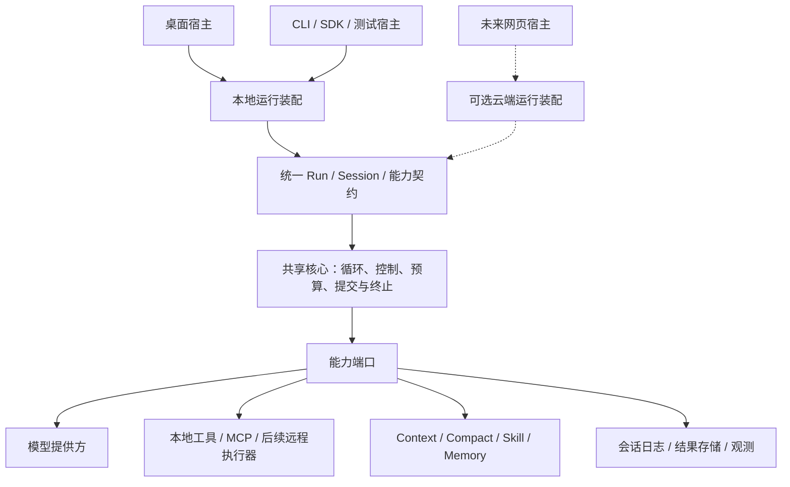

# Box-Agent 桌面与共享核心长期演进方案

日期：2026-09-28。实施状态基线：`6dafd19`（T12）。本文记录长期目标与阶段验收条件，不表示目标架构全部已经实现，也不承诺网页端或云端的上线时间。

阅读顺序：先读本文确定方向和边界，再读 [14 模块任务总览](ROADMAP.md)选择工作包，最后读具体 T 系列方案和验证记录。现有架构见 [分层架构](../../ARCHITECTURE_CN.md)，设计评估依据见 [harness 评估](../harness-review-cn.md)。

## 1. 长期目标与当前投入范围

形成可由不同宿主装配的共享 Agent 核心，让桌面、未来网页及其他宿主遵循相同的运行、权限、预算、恢复和结果契约。桌面继续具备完整的本地 Agent 执行能力，可以直接接入第三方模型；使用本地模型还是远程模型由提供方配置决定。

当前投入集中在桌面优化与共享核心建设。修改客户端后台时按这一边界组织模块；网页产品、云端执行服务、多语言执行协议和核心语言迁移，均在后续阶段满足进入条件后另立方案。

固定原则：

- 桌面本地执行路径持续可用；不能将桌面改为依赖云端 Agent 服务的纯前端。本地执行不等于所有模型和工具都能离线使用。
- 共享核心复用一套运行语义。宿主负责协议、UI 和能力装配，不各自复制主循环、预算或通用续跑策略。
- 多端一致指核心契约和能力相同时的行为一致；设备工具、权限和模型不同，可以产生不同结果，应明确告知可用能力。它不等于模型文本逐字一致。
- Session Log 保持会话事实来源；UI、Trace、Context 投影和后续快照不形成第二份权威会话状态。Memory 是独立的跨会话经验。
- 稳定 Kernel 保留执行顺序、取消、预算和提交不变量；领域流程、格式规则及完成验收归所属 Tool、Skill 或插件。
- 核心语言选择由性能证据和迁移成本决定，不将“换语言”作为共享核心建成的前提。

## 2. 目标架构与职责

图表示目标依赖关系；虚线部分尚不实施。“共享”首先指同一实现和契约可在不同位置运行，并不要求所有桌面连接同一个服务进程。

| 层次 | 负责 | 与其他层的边界 |
| --- | --- | --- |
| 宿主适配 | UI、ACP/CLI 等协议映射、权限交互、用户输入和结果呈现 | 消费共享事件与结果，不决定核心预算或复制循环 |
| 运行装配 | 创建 Session、绑定 Provider 与能力、作用域和资源清理 | 显式区分自有与借入资源；不通过整份 Agent 隐式传递依赖 |
| 共享核心 | 请求→响应→动作→提交→终止；取消、运行归属、硬预算和调用闭合 | 不直接依赖 Electron、网页会话或产品格式规则 |
| 能力模块与插件 | 模型、工具、上下文、压缩、持久化、经验及领域策略 | 通过明确端口和生命周期接入；声明能力不等于获得权限 |
| 执行与存储设施 | 本地进程、远程执行器、文件或未来服务存储 | 将超时、取消和未知结果如实反馈，不把传输失败当成动作未执行 |

插件化按职责逐步推进，优先使用现有 Ports、Hook 和 PluginHost。不会为了统一名称，把所有模块立即改成动态加载插件或新增跨进程调用。

## 3. 状态与“无状态服务”的含义

Agent 的运行必然有状态。未来云端“无状态”指服务实例可替换、不会永久占有唯一会话事实；不要求每一步都清空对象，也不保证正在执行的工具能无缝转移。

| 状态范围 | 内容 | 演进约束 |
| --- | --- | --- |
| 进程／应用 | 插件注册、连接池、可重建缓存 | 不混入某个用户的授权、cwd 或历史 |
| Session | 模型及能力绑定、会话历史、工作区和授权作用域 | 每个会话一个有效运行所有者；跨端并发输入必须有顺序和冲突规则 |
| Run | 取消、权限等待、事件序号、预算、在途工具 | 当前按进程内契约管理；跨实例接管需另外设计租约、过期所有者隔离和恢复规则 |
| 请求／Step | PreparedTools、上下文投影、参数及模型响应 | 本次看到的能力必须与实际执行目标匹配；未完整的工具参数不执行 |
| 持久事实 | 工具意图、结果、终止与恢复记录 | 明确 append、flush、durable 的差别；派生快照需能按日志版本校验 |

云端阶段必须解决共享预算的原子扣减、权限请求归属、取消路由、断线重连以及事件恢复。当前单 Run 有界队列提供背压，不是持久消息总线，不能据此声称已支持断线续传。

本地执行与云端执行之间不能在未知结果时自动重放任务。若外部操作没有幂等键或状态查询能力，恢复应保留 outcome unknown；模型或客户端的重试不能保证 exactly-once。多设备会话同步、文件同步和运行迁移是不同问题，需独立确定产品需求。

## 4. 四阶段实施路径

### 阶段一：补齐桌面运行契约

**目标：** 先让现有桌面运行可控、可恢复、可测量，形成后续提取共享核心的稳定基线。

**工作：** 终止语义、消费者生命周期、事件容量、取消与权限、祖先共享预算、工具去重与副作用边界；补充任务级质量、成本、延迟和恢复评估。优先处理真实缺陷，不扩大为全面目录迁移。

**已完成部分：** T1–T6 的共享运行边界，T7–T9e 的兼容及缺陷修复，T10/T11 桌面联调与兼容审查，T12 显式去重。目标验收证据、完整 effect/重试契约及任务级评估基线仍待建设；不能将阶段一整体标记为完成。

**验收与进入下一阶段的条件：** 被提取职责的事件轨迹、权限、预算、取消及持久化提交点有可重复回归；失败与跳过有明确原因。先为选定职责建立基线即可逐项进入阶段二，不必等所有模块优化结束。正式发布另需实际 runtime 构建、安装、宿主重启与新任务验证。

### 阶段二：形成可独立组装的共享核心

**目标：** 桌面通过稳定装配入口使用共享核心，核心可在不加载桌面适配的情况下运行。

**工作：**

1. 明确资源 creator、owner、borrower、关闭时机，以及 Process／Session／Run／Request 的作用域。
2. 每次从 Kernel 移出一种能力策略，如结果适配、Memory 具体策略或计划领域逻辑；复用现有端口，保留循环不变量。
3. 收敛通用续跑与恢复的编排归属；宿主保留协议渲染和交互，Provider 保留单次请求 timeout 权威。
4. 建立模型、工具、上下文、存储、权限及观测的契约测试，兼容入口转换参数后复用同一路径。

**验收：** 相同确定性输入和能力下，重构前后事件顺序、有效历史、停止原因、预算和提交点一致；初始化中途失败能逆序清理，借入资源不误关闭，取消后 Session 可复用。桌面仍能直接接第三方模型，核心无需导入桌面适配。

**进入下一阶段的条件：** 一个轻量宿主可以通过公开装配契约执行真实循环，不需要复制策略或访问桌面私有字段。仅文件拆分或测试中绕过循环不算完成。

### 阶段三：验证跨宿主复用

**目标：** 在不建设网页产品的前提下，证明共享核心的契约能够被不同宿主正确使用。

**工作：** 使用 SDK、CLI、ACP 和轻量测试宿主运行同一组脚本，覆盖流式／仅结果消费、权限等待、取消、预算、恢复和错误；统一脱敏配置来源与用量口径。建立固定任务集、环境快照和独立结果验证，比较质量、延迟与成本。

**验收：** 协议适配后得到等价的终止与工具执行事实；宿主差异能归因到显式能力或配置。确定性测试校验精确轨迹；真实模型任务用结果、约束遵循和统计指标评估，不要求文本一致。关闭非关键观测不改变执行结果。

**进入云端阶段的条件：** 产品确实需要云端执行，且已明确数据位置、可用能力、并发规模、可用性、延迟与成本目标。性能和可用性阈值在实施前由具体负载确定，不能事后按测试结果倒定指标。

### 阶段四：按产品排期扩展运行形态

**目标：** 保留桌面本地运行，同时支持按需增加云端执行、远程工具及多语言能力。

本阶段按独立项目决策，不要求云端化、多语言插件和语言迁移同时发生：

| 工作包 | 进入条件 | 必须证明 |
| --- | --- | --- |
| 网页／云端宿主 | 产品需求和阶段三基线明确 | 身份与租户隔离、会话归属、状态持久化、队列准入、全局限流、实例故障恢复、灰度与回退 |
| 远程端侧工具 | 云端运行确需使用设备能力 | 设备在线状态、权限绑定、调用身份、超时／取消／断线结果、产物传输；不会扩大端侧授权 |
| 多语言插件 | 有具体的外部语言能力需求，进程内接口不适用 | 版本化请求／结果、错误与取消语义、生命周期、数据大小上限、协议兼容及端到端开销 |
| 核心语言迁移 | 剖析证明 Python 核心确为瓶颈，且收益超过迁移成本 | 新旧实现通过同一契约与故障集；真实任务质量不回退；性能收益包含跨语言调用成本 |

高并发与高可用依赖准入、资源池、背压、隔离、恢复和外部服务容量，不能仅由更换语言获得。先测模型等待、工具耗时、CPU、内存及并发瓶颈，再决定局部加速或整体迁移；当前不预选语言、RPC 框架或数据库。

若出现多语言核心实现，共享的首先是版本化契约、测试向量和行为基线。新旧实现只在迁移期间有计划地并存，按宿主或会话灰度；外部副作用不得为比较实现而重复执行。日志与协议兼容必须明确版本和回退读取规则。

## 5. 与 14 模块和工作包的关系

14 模块是职责清单，四阶段是演进顺序，T 系列是可独立评审与回退的实施任务。三者不能互相替代。

| 阶段 | 重点模块 | 当前可执行方向 |
| --- | --- | --- |
| 一 | 1、4、7、8、9、10、11、14 | 补齐任务评估及剩余执行／恢复契约；已有 T 系列作为回归基线 |
| 二 | 2、3，并贯穿 5、6、12、13、14 | 资源所有权、主循环单项策略提取、Ports 契约、通用编排 |
| 三 | 1、4、8、10、14，配合各能力模块 | 跨宿主等价性、配置及用量观测、任务质量与恢复评估 |
| 四 | 全部模块的宿主和执行设施扩展 | 由产品排期和测量证据启动，另立详细实现方案 |

当前以阶段一、二为主要投入，阶段三的契约测试可随重构同步建立。具体工作顺序沿用 [ROADMAP](ROADMAP.md)；每次挑选一个可验证职责，不预先把全部长期建议变成一次大改造。

## 6. 每项实施的评审与交付门禁

实施前写明固定边界、保持行为的收敛、功能变化、兼容影响、验收和回退方式。保持行为的任务用确定性轨迹对照；功能任务增加直接回归与迁移说明；性能任务先保存可复现基线。偏离方案时在提交前同步修订。

每个任务独立提交方案、代码、测试和实际验证记录。只暂存相关路径，保留其他工作；未执行或未通过的检查不能记为通过。不因长期方向而自动启动云端开发、安装产品或发布。

交付状态分别记录：源码修改 → 源码测试 → runtime 构建 → 安装 → 启动探针 → 宿主重启 → 新真实任务验证。wheel/sdist 可构建不等于 standalone runtime 已安装；运行中的进程也不会自动加载新源码。

## 7. 本次文档落盘范围

本次新增长期方案，并在 README 和 ROADMAP 建立入口。固定边界是现有 T1–T12 实现和已记录的产品排期；没有代码、配置、依赖或运行时变更。验证文档相对链接和差异格式，不重跑产品测试或构建；回退本次文档提交即可撤销新增说明。
